  <picture>
    <source media="(max-width: 760px) and (prefers-color-scheme: dark)" srcset="./assets/hero/agent-console-v5-mobile-dark.svg">
    <source media="(max-width: 760px)" srcset="./assets/hero/agent-console-v5-mobile-light.svg">
    <source media="(prefers-color-scheme: dark)" srcset="./assets/hero/agent-console-v5-dark.svg">
    <source media="(prefers-color-scheme: light)" srcset="./assets/hero/agent-console-v5-light.svg">
    
  </picture>

  
  
  

## About Me

I am **Rahmandika Haekal**, a front end web developer focused on building practical, clean, and user-friendly web interfaces.

I work mostly around modern JavaScript ecosystems, especially **Vue**, **Nuxt**, and dashboard or company profile projects. I also use Ubuntu for development and daily work, and I am a Muslim youth programming community.

## Current Focus

| Area | What I am exploring |
| --- | --- |
| **Front End Development** | Building responsive websites, dashboards, and reusable user interface patterns. |
| **Vue & Nuxt** | Improving application structure, component design, routing, and frontend performance. |
| **Company Profiles** | Creating clean web presentations for brands, organizations, and charity projects. |
| **Developer Workflow** | Working comfortably with Linux, Git, Figma, and modern web tooling. |

## Featured Work

| Work | Focus | Why it matters |
| --- | --- | --- |
| **Company Profile Websites** | Business and organization landing pages | Helps teams present their identity, services, and contact flow clearly on the web. |
| **Charity Web Projects** | Campaign and donation-oriented interfaces | Supports short-term social projects with accessible and focused web experiences. |
| **Dashboard Interfaces** | Admin and operational UI | Turns data and workflows into interfaces that are easier to scan, manage, and maintain. |
| **Frontend Experiments** | Vue, Nuxt, CSS, and SCSS | Strengthens implementation skill through direct practice with modern frontend stacks. |

## Direction

I am interested in frontend systems that are simple to use, easy to maintain, and clear for the people who depend on them.

My current direction is to keep improving as a web developer, build more real projects, and grow toward creating my own programming team, JavaScript framework ideas, and CSS or SCSS tooling.

## Tech Stack

  
  
  
  
  
  
  
  
  
  
  
  

## Contact

If you want to reach out about web projects, frontend development, collaboration, or just to talk, you can contact me here:

  
  

---

  Building practical web interfaces with Vue, Nuxt, and modern frontend tools.

